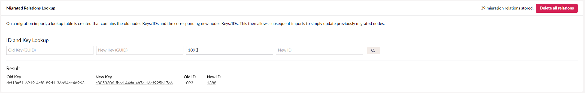
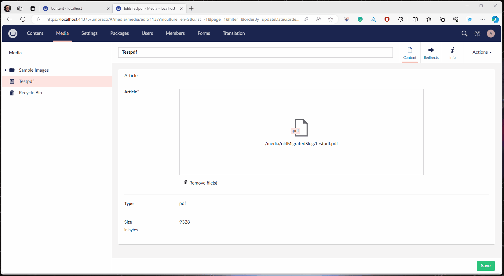

# Method4.UmbracoMigrator.Target - Documentation

Please see the [roadmap](./ROADMAP.md) for a list of outstanding features and TODOs.

# The Backoffice Dashboard
The dashboard can be found on the tree in the `Settings` section.


## ⚙️ Settings
- Don't publish nodes after import
     - Nodes will not be published after a migration import
- Overwrite if the node/property already exists
     - If a node already exists and a property, that should be mapped, already has a value; then we will overwrite that value.
- Disable Default Mappers
     - The built-in default mappers automatically map any property that has an identical alias, this will disable that.
- Clean Import
     - This will delete all content, and media and wipe the migrator key relations table before importing.

## 🔎 Migrated Relations Lookup
After importing a migration snapshot, the `MigrationLookups` database table will contain lookup tables of old node Keys and IDs and their corresponding new Keys and IDs.

The search boxes can be used to quickly find the new Key and ID if needed.


<br>

# ⚒️ Default Mappers ⚒️
The package includes a set of default DocType and MediaType mappers.
These default mappers are "Lazy" mappers, which means that they will:
- Map old DocTypes if a new DocType with a matching alias exists.
- Map old properties if the new node contains a property with a matching alias.
     - Old Key references will be transformed using the `IKeyTransformer` helper.
     - If a property's format needs to be updated, it will attempt to transform the property value into the new format using the `IPropertyEditorConverter` helper.
     - TinyMCE Rich Text Editor values will be passed through Umbraco's `MacroTagParser.FormatRichTextContentForPersistence()` method, to ensure that Macros are formatted correctly.

<br>

# ⚒️ Custom Mappers ⚒️
Custom mappings can be defined using these interfaces, these custom mappings will then be run after the default mappers, so you will only need to define mappers for properties/doctypes that the default mappers cannot do e.g:
- If an alias has changed between your sites.
- If the property editor type has changed and you need to do a manual conversion.
- If you need to manually modify a value for some other reason.

Examples of custom mappers can be found in the sample site, and in the `/docs/custom_mapper_examples/` folder: [/docs/custom_mapper_examples](./custom_mapper_examples)

## ⚒️ IDocTypeMapping - `Method4.UmbracoMigrator.Target.Core.Mappers`
### Properties:
- _DocTypeAlias_ - The alias of the DocType this mapper can map to

### Methods:
- _bool **CanIMap**(MigrationContent MigrationNode)_
     - Tells the migrator if this mapper can map the given migrationNode.
- _IContent **MapNode**(MigrationContent oldNode, IContent newNode, bool overwiteExisitingValues)_
     - Custom mapping logic goes here.
     - _newNode_ will be of the DocType defined in the _DocTypeAlias_ property. 
          - If default mappers are enabled, then _newNode_ will already have its default properties (and properties with identical aliases) mapped at this point.
     - _oldNode_
          - The old node, properties can be accessed like so: `oldNode.Properties["propertyAlias"]`

### Example:
```
public class MyNewDocTypeMapper : IDocTypeMapping
{
    public string DocTypeAlias => "myNewDocType"; // The doctype I want to map to

    public bool CanIMap(MigrationContent MigrationNode)
    {
        return MigrationNode.ContentType == "myOldDocType"; // I can map old nodes of this doctype
    }

    public IContent MapNode(MigrationContent oldNode, IContent newNode, bool overwiteExisitingValues)
    {
        newNode.SetValue("myNewProperty", oldNode.Properties["myOldProperty"]); // Map property with a different name

        return newNode;
    }
}
```

## ⚒️ IMediaTypeMapping - `Method4.UmbracoMigrator.Target.Core.Mappers`
Essentially the same as IDocTypeMapping, but for Media nodes.

<br>

# 🚀 Helper Classes 🚀
The package is shipped with a couple of helper classes to assist you in your migration mappers.

## 🚀 IKeyTransformer - `Method4.UmbracoMigrator.Target.Core.Helpers`
This class can convert old Key (GUID) references in certain PropertyEditor values, into their new Key counterparts, using the MigrationKeyLookups db table.

### Supported propertyEditors:
- Umbraco.MediaPicker
- Umbraco.MediaPicker3
- Umbraco.ContentPicker
- Umbraco.MultiUrlPicker
- Umbraco.MultiNodeTreePicker
- Umbraco.TinyMCE

### Methods:
- _bool **CanHaveKeyTransformed**(string newPropertyAlias)_
     - Returns true if the given propertyAlias can be transformed by the _TransformOldKeyReference_ method
- _string **TransformOldKeyReferences**(IProperty newProperty, string value)_
- _bool **TryTransformOldKeyReferences**(IProperty newProperty, string value, out string transformedValue)_
- _string **TransformOldKeyReferences**(string newPropertyEditorAlias, string value)_
- _bool **TryTransformOldKeyReferences**(string newPropertyEditorAlias, string value, out string transformedValue)_
     - If the newProperty is of a valid type, then it will attempt to find the GUID Key in the value of the oldProperty, and transform it into the corresponding new GUID Key. (using the key lookup db table)


## 🚀 IPropertyEditorConverter - `Method4.UmbracoMigrator.Target.Core.Helpers`
This class can convert certain old PropertyEditor values into their new counterpart's format.

### Supported propertyEditor conversions:
- MediaPicker (legacy) / MediaPicker 2 > MediaPicker3

### Methods:
- _bool **CanConvert**(string newPropertyEditorAlias, string oldPropertyEditorAlias)_
- _bool **CanConvert**(IProperty newProperty, MigrationProperty oldProperty)_
     - Returns true if the given oldPropertyEditorAlias can be converted into the newPropertyEditorAlias
- _string **Convert**(string newPropertyEditorAlias, string oldPropertyEditorAlias, string oldPropertyValue)_
- _bool **TryConvert**(string newPropertyEditorAlias, string oldPropertyEditorAlias, string oldPropertyValue, out string result)_

### Specific Conversion Methods:
- _bool **TryConvertMediaPickerValueToMediaPicker3Value**(string mediaPickerValue, out string mediaPicker3Value)_
- _string **ConvertMediaPickerValueToMediaPicker3Value**(string mediaPickerValue)_

## 🚀 IKeyLookupService - `Method4.UmbracoMigrator.Target.Core.Services`
This service is for interacting with the MigrationKeyLookups database table, this table holds a simple KeyValue list of old Guid Keys and their corresponding new Guid Keys.

### Methods:
- _Guid? **GetNewKey**(string oldKey)_
- _Guid? **GetNewKey**(Guid oldKey)_
     - Returns the new GUID Key for the given old Key

## 🖼️ What about my Media Files?
On the [Method4.UmbracoMigrator.Source](https://github.com/Method4Ltd/Method4.UmbracoMigrator.Source) package, you can choose to include the physical media files in the migration snapshot, these would then be uploaded to your site's media folder (or Azure blob storage if configured) during a migration import.

> **Note:** If you have a large amount of media files, this process can be very slow. 
> <br />Thereore we recommend manually copying your media files across. (e.g. using Azure Storage Explorer)

## ↗️ Automatic Media Redirects
If a media file is deleted and re-uploaded on a media node (e.g. to replace an old file with an updated one), then the GUID slug in the URL will be different.

This is due to the fact that the default Umbraco _IMediaPathScheme_ implementation ([UniqueMediaPathScheme.cs](https://github.com/umbraco/Umbraco-CMS/blob/a2a2680defd40ed0ef72fb85bf6d7a9bf1db33bc/src/Umbraco.Core/IO/MediaPathSchemes/UniqueMediaPathScheme.cs#L16C2-L17)) generates the GUID slug by combining the GUID of the media node and the GUID of the property; and in the case of our migrated media, these values will be different.

> You can read Owain's blog, which goes into this issue in further detail, here: https://owainjones.dev/blog/how-a-custom-imediapathscheme-came-to-the-rescue-for-our-migrated-media/

As a workaround, this package includes a custom implementation of _IMediaPathScheme_ ([MigratedUrlRedirectMediaPathScheme.cs](https://github.com/Method4Ltd/Method4.UmbracoMigrator.Target/blob/v10/main/src/Method4.UmbracoMigrator.Target.Core/MediaPathSchemes/MigratedUrlRedirectMediaPathScheme.cs)), which extends the default _UniqueMediaPathScheme.cs_, and auto-creates a [Skybrud Redirects](https://marketplace.umbraco.com/package/skybrud.umbraco.redirects) redirect in the event that an in-place file replacement is performed on one of the migrated media nodes.

>**Note:** The [Skybrud Redirects](https://marketplace.umbraco.com/package/skybrud.umbraco.redirects) package will need to be installed for this to work.

GIF of it in action:


This functionality can be enabled with the following app settings:
```
  "Method4": {
    "UmbracoMigrator": {
      "Target": {
        "EnableMediaRedirectGeneration": true,       // Enables the UniqueMediaPathScheme IMediaPathScheme - Default Value: 'false'
        "MediaFileUploadPropertyAlias":  "myAlias"   // The property type alias of the Umbraco.UploadField - Default value: 'umbracoFile' 
      }
    }
  }
```
<br>

## 🤔 How do I migrate my DocTypes and MediaTypes?
That's up to you! This package expects the doctypes to already be in place, it only migrates the data.

The method we use depends on the requirements of the migration, is it just a lift and shift? or a full-blown re-build? If it's simply a lift and shift, then we usually use a uSync export to import the old DocTypes onto the new site.
